# High-Level Design (HLD)

## NHIS Fraud Analyzer System

---

## 1. System Overview

The NHIS Fraud Analyzer is a full-stack web application designed to detect and analyze potentially fraudulent health insurance claims using rule-based algorithms and data analytics. The system processes CSV files containing claims data, applies configurable fraud detection rules, and presents insights through an interactive dashboard.

### 1.1 System Goals

- **Fraud Detection**: Automatically identify suspicious claims using configurable rules
- **Data Processing**: Handle large CSV files with validation and deduplication
- **Analytics**: Provide real-time insights and trends
- **Configurability**: Allow administrators to tune fraud detection parameters
- **Scalability**: Support growing datasets and user base

### 1.2 Key Stakeholders

- **Healthcare Auditors**: Primary users who review flagged claims
- **System Administrators**: Configure scoring rules and manage data
- **Data Analysts**: Analyze trends and patterns
- **Compliance Officers**: Ensure regulatory compliance

---

## 2. System Architecture

### 2.1 Architecture Style

**Layered Architecture with Clean Separation**

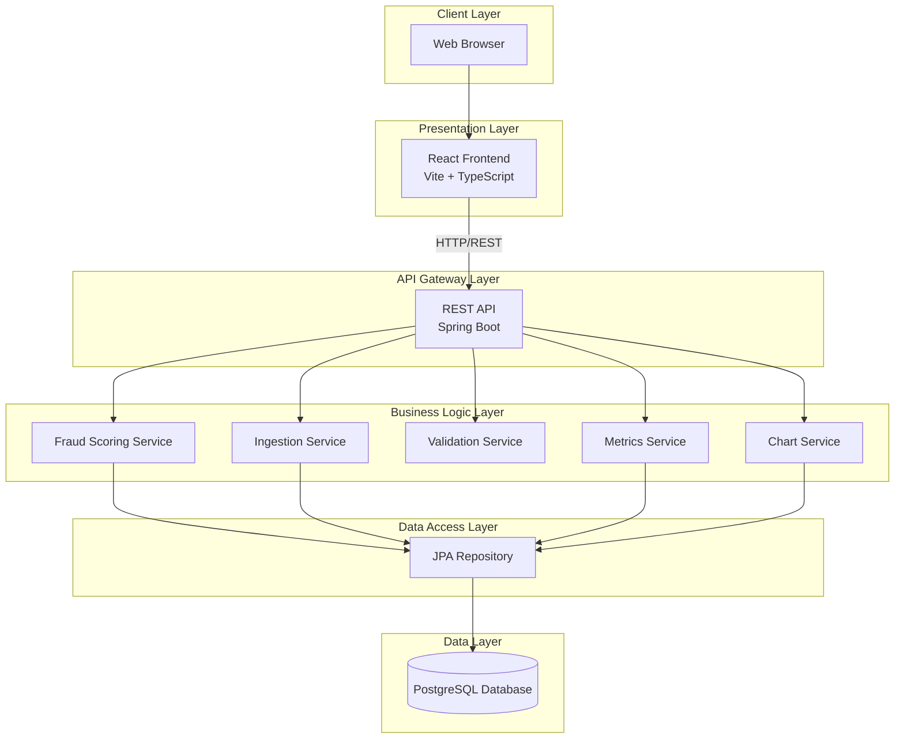

### 2.2 Component Architecture

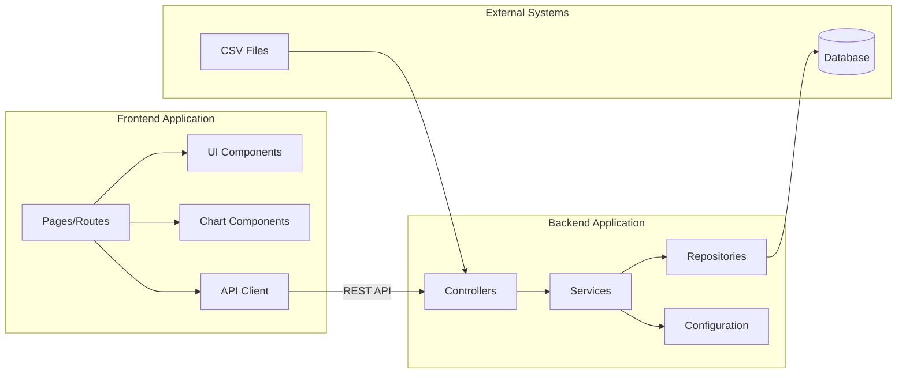

---

## 3. System Components

### 3.1 Frontend Components

#### 3.1.1 Core Pages

| Component | Purpose | Key Features |
|-----------|---------|-------------|
| **Dashboard Page** | Overview analytics | Metrics cards, charts, date filtering |
| **Claims Page** | Claims management | Pagination, filtering, sorting, search |
| **Admin Page** | System configuration | CSV upload, scoring config |
| **Login Page** | User authentication | Login form (future implementation) |

#### 3.1.2 Shared Components

- **App Sidebar**: Navigation menu
- **Site Header**: Top navigation bar
- **Data Table**: Reusable table with pagination
- **Charts**: Fraud category, score distribution, trends
- **Filters**: Advanced filtering UI
- **UI Components**: Radix-based design system

#### 3.1.3 API Client

```typescript
// Centralized API communication
- getJson<T>(): GET requests
- postMultipart<T>(): File uploads
- putJson<T>(): Update operations
```

### 3.2 Backend Components

#### 3.2.1 Controllers Layer

| Controller | Endpoint Base | Responsibility |
|------------|---------------|----------------|
| **ClaimsController** | `/api/v1/claims` | Claims CRUD and queries |
| **MetricsController** | `/api/v1/metrics` | Analytics and aggregations |
| **AdminController** | `/api/v1/admin` | Data ingestion and config |

#### 3.2.2 Service Layer

| Service | Responsibility |
|---------|----------------|
| **FraudScoringService** | Implements fraud detection algorithm |
| **IngestionService** | CSV parsing, validation, processing |
| **ValidationService** | Data validation rules |
| **MetricsService** | Calculate aggregate metrics |
| **ChartService** | Prepare time-series data |

#### 3.2.3 Repository Layer

```java
// ClaimRepository extends JpaRepository
- Spring Data JPA for CRUD
- JPA Specifications for dynamic queries
- Custom queries for complex aggregations
```

#### 3.2.4 Configuration Components

- **ScoringConfig**: In-memory fraud scoring parameters
- **CorsConfig**: Cross-origin resource sharing
- **Application Properties**: Database, server, multipart config

---

## 4. Data Flow Diagrams

### 4.1 Claims Data Ingestion Flow

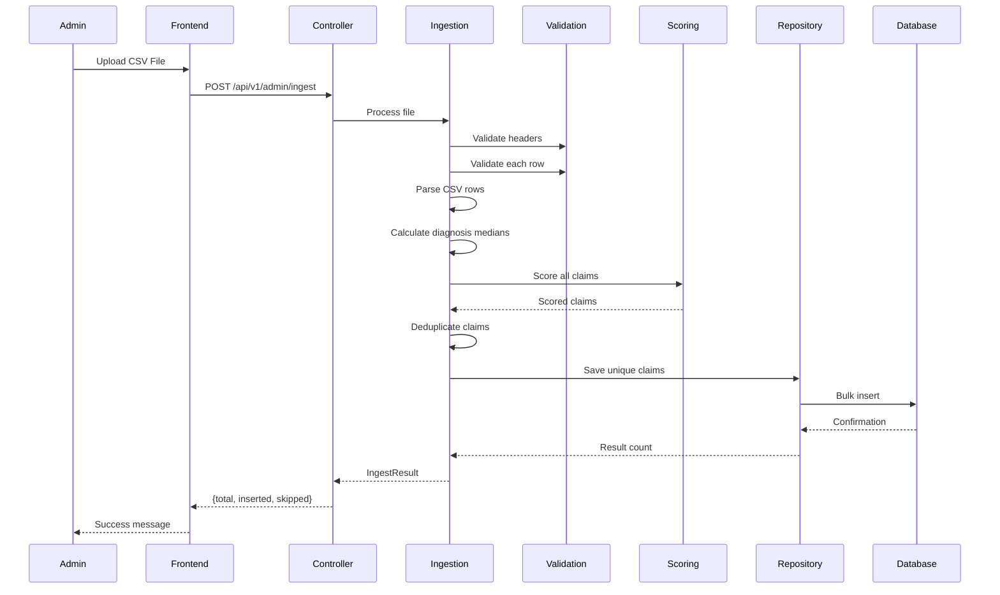

### 4.2 Claims Query Flow

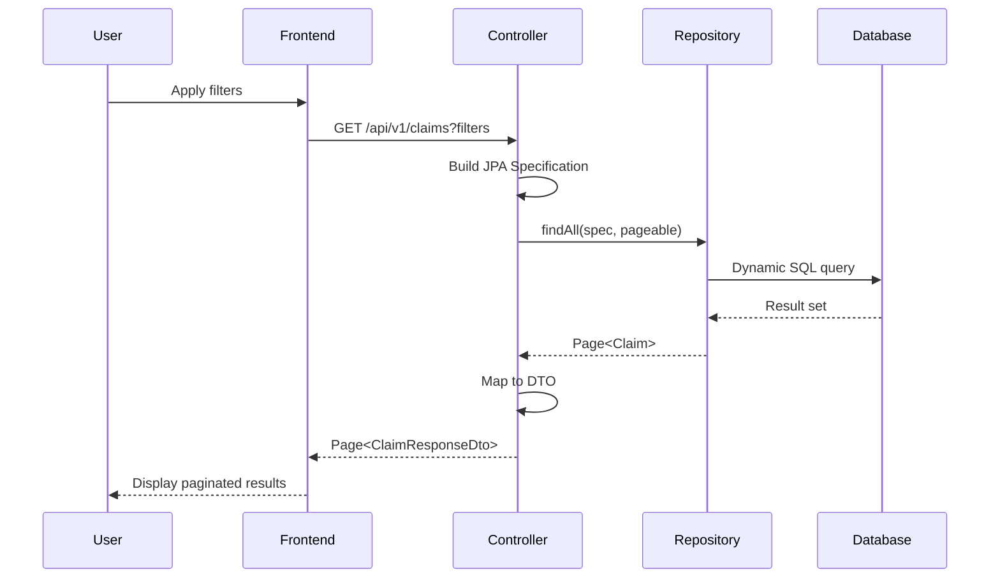

### 4.3 Dashboard Metrics Flow

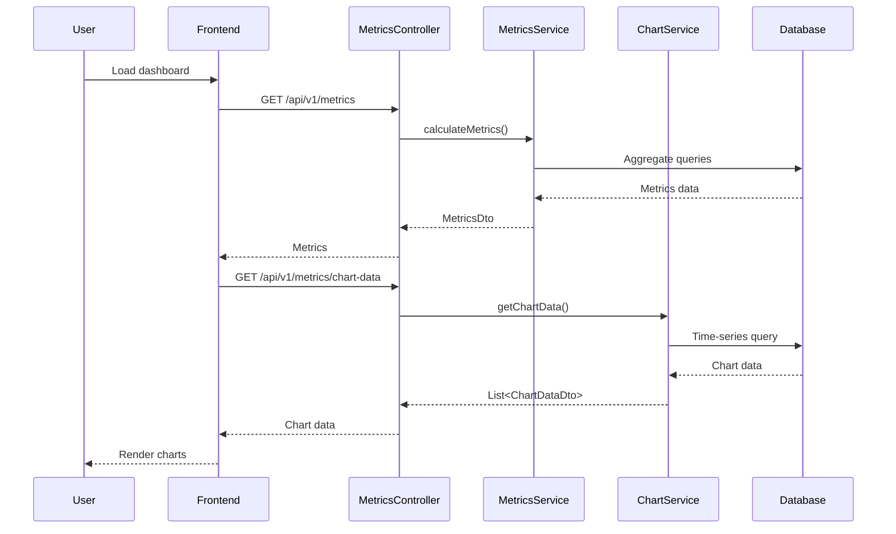

---

## 5. Database Architecture

### 5.1 Database Schema

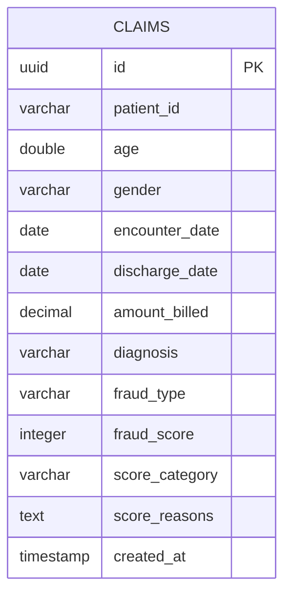

### 5.2 Indexes

| Index Name | Columns | Purpose |
|------------|---------|----------|
| `idx_claims_patient` | patient_id | Patient lookup |
| `idx_claims_diagnosis` | diagnosis | Diagnosis filtering |
| `idx_claims_fraudScore` | fraud_score | Score-based queries |
| `pk_claims` | id | Primary key |

### 5.3 Data Volume Considerations

- **Estimated Claims/Year**: 100,000 - 1,000,000
- **Storage per Claim**: ~500 bytes
- **Total Storage (1M claims)**: ~500 MB
- **Growth Rate**: 10-20% annually

---

## 6. Integration Points

### 6.1 External Integrations

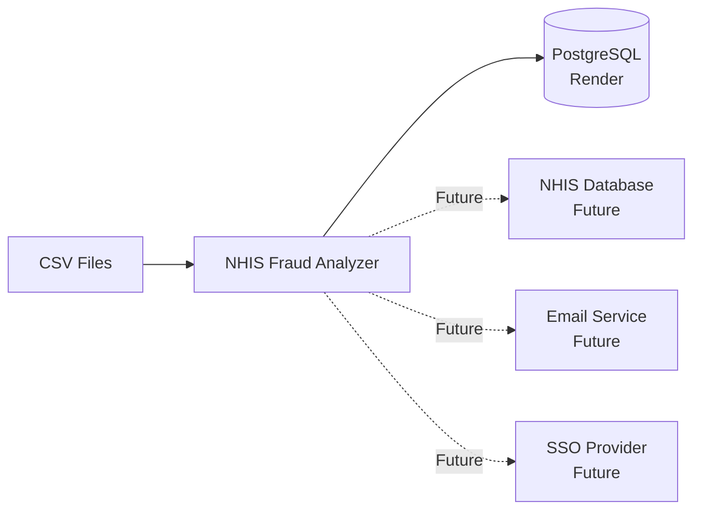

### 6.2 API Contract

- **Protocol**: HTTP/REST
- **Format**: JSON
- **Authentication**: None (future: JWT)
- **CORS**: Enabled for development
- **API Versioning**: URL-based (`/api/v1/`)

---

## 7. Deployment Architecture

### 7.1 Current Deployment

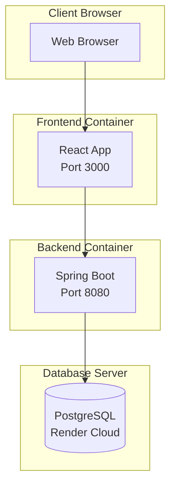

### 7.2 Recommended Production Architecture

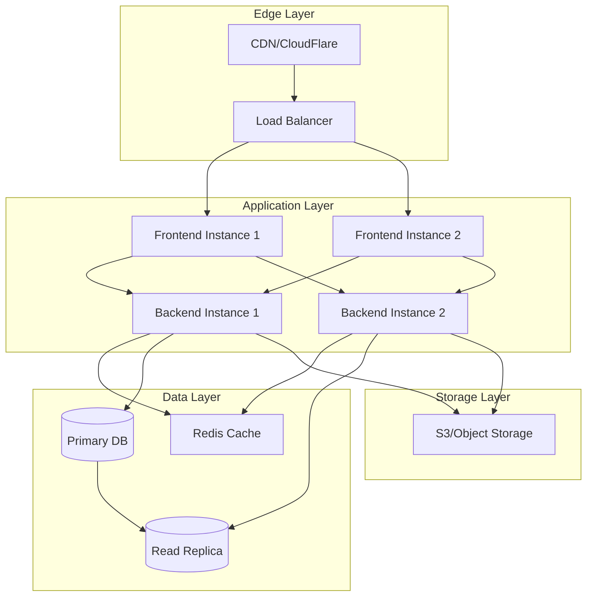

---

## 8. Security Architecture

### 8.1 Security Layers

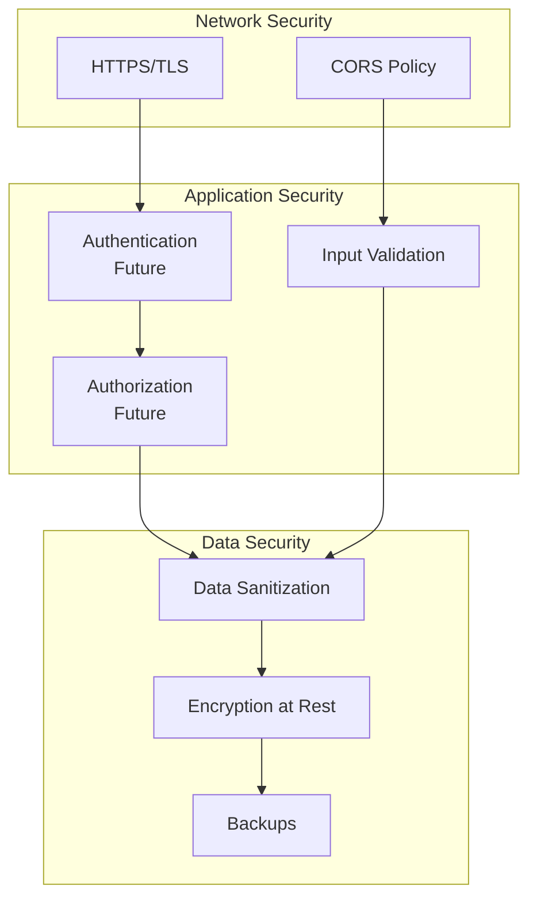

### 8.2 Data Protection

- **PHI/PII Handling**: Claims contain sensitive health information
- **Compliance**: HIPAA considerations (future implementation)
- **Data Retention**: Configurable retention policies needed
- **Audit Logging**: Track all data access (future)

---

## 9. Scalability Considerations

### 9.1 Horizontal Scaling

- **Stateless Backend**: Can scale horizontally with load balancer
- **Database**: Read replicas for query distribution
- **Frontend**: CDN distribution for static assets

### 9.2 Vertical Scaling

- **Database**: Increase instance size for growing data
- **Backend**: Increase JVM heap for larger batch processing

### 9.3 Performance Optimizations

- Database connection pooling
- Query optimization with indexes
- Pagination for large result sets
- Lazy loading in frontend
- API response caching (future)

---

## 10. Monitoring & Observability

### 10.1 Monitoring Strategy

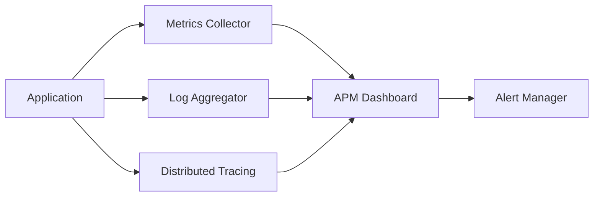

### 10.2 Key Metrics to Monitor

- **Application**: Response time, error rate, throughput
- **Database**: Connection pool, query time, deadlocks
- **Business**: Claims processed, fraud detection rate
- **Infrastructure**: CPU, memory, disk, network

---

## 11. Disaster Recovery

### 11.1 Backup Strategy

- **Database Backups**: Daily full, hourly incremental
- **Configuration Backups**: Version controlled
- **Data Retention**: 90 days minimum

### 11.2 Recovery Objectives

- **RTO (Recovery Time Objective)**: 4 hours
- **RPO (Recovery Point Objective)**: 1 hour

---

## 12. Technology Decisions Summary

| Decision | Choice | Rationale |
|----------|--------|----------|
| **Backend Language** | Java 21 | Enterprise stability, type safety, performance |
| **Backend Framework** | Spring Boot | Rapid development, extensive ecosystem |
| **Database** | PostgreSQL | ACID compliance, JSON support, open source |
| **Frontend Framework** | React | Component reusability, large ecosystem |
| **UI Library** | Radix UI + Tailwind | Accessibility, customization |
| **Build Tool (Frontend)** | Vite | Fast HMR, modern tooling |
| **Routing** | TanStack Router | Type-safe, file-based routing |
| **API Documentation** | Swagger/OpenAPI | Interactive docs, standardized |

---

## 13. Future Architecture Enhancements

### 13.1 Microservices Migration

- Extract fraud scoring to separate service
- Separate analytics service
- Event-driven architecture with message queues

### 13.2 Machine Learning Integration

- ML-based fraud detection models
- Real-time scoring pipeline
- Model training and deployment

### 13.3 Real-time Processing

- Stream processing for live data
- WebSocket for real-time updates
- Event sourcing for audit trail

