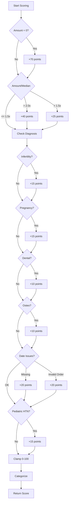
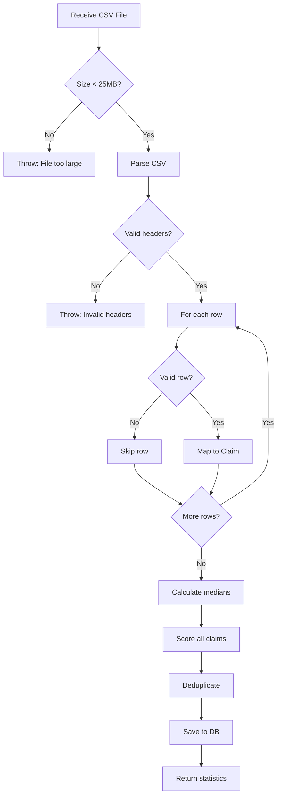

# Low-Level Design (LLD)

## APEIRO NHIS Fraud Analyzer Service

---

## 1. Detailed Component Design

### 1.1 Backend Package Structure

```
com.nhis.fraud/
├── config/
│   ├── ScoringConfig.java          # Fraud scoring configuration
│   └── CorsConfig.java             # CORS configuration
├── controller/
│   ├── ClaimsController.java       # Claims API endpoints
│   ├── MetricsController.java      # Metrics API endpoints
│   └── AdminController.java        # Admin API endpoints
├── dto/
│   ├── ClaimResponseDto.java       # Claim response object
│   ├── MetricsDto.java             # Metrics response object
│   ├── ScoringConfigDto.java       # Scoring config DTO
│   ├── ChartDataDto.java           # Chart data DTO
│   └── ErrorResponse.java          # Error response DTO
├── entity/
│   ├── Claim.java                  # JPA entity for claims
│   └── ScoreCategory.java          # Enum for score categories
├── exception/
│   ├── BadRequestException.java    # Custom exception
│   └── GlobalExceptionHandler.java # Global error handling
├── repository/
│   └── ClaimRepository.java        # JPA repository
├── service/
│   ├── FraudScoringService.java    # Fraud detection logic
│   ├── IngestionService.java       # CSV processing
│   ├── ValidationService.java      # Data validation
│   ├── MetricsService.java         # Metrics calculation
│   └── ChartService.java           # Chart data preparation
├── spec/
│   └── ClaimSpecifications.java    # JPA Specifications
├── util/
│   └── CsvUtils.java               # CSV utilities
└── FraudApplication.java           # Main application class
```

---

## 2. Data Model Design

### 2.1 Entity: Claim

```java
@Entity
@Table(name = "claims", indexes = {
    @Index(name = "idx_claims_patient", columnList = "patientId"),
    @Index(name = "idx_claims_diagnosis", columnList = "diagnosis"),
    @Index(name = "idx_claims_fraudScore", columnList = "fraudScore")
})
public class Claim {
    @Id
    @Column(nullable = false, updatable = false)
    private UUID id;  // Primary key
    
    @Column(nullable = false)
    private String patientId;  // Patient registration number
    
    private Double age;  // Patient age
    
    private String gender;  // M/F/Other
    
    private LocalDate encounterDate;  // Date of service
    
    private LocalDate dischargeDate;  // Discharge date
    
    @Column(precision = 15, scale = 2)
    private BigDecimal amountBilled;  // Claim amount
    
    @Column(length = 512)
    private String diagnosis;  // ICD code or description
    
    private String fraudType;  // Type of fraud (if known)
    
    private Integer fraudScore;  // Calculated score (0-100)
    
    @Enumerated(EnumType.STRING)
    private ScoreCategory scoreCategory;  // LOW/MEDIUM/HIGH
    
    @Column(columnDefinition = "text")
    private String scoreReasons;  // Explanation of score
    
    @Column(nullable = false, updatable = false)
    private OffsetDateTime createdAt;  // Record creation time
}
```

### 2.2 Enum: ScoreCategory

```java
public enum ScoreCategory {
    LOW,     // Score 0-25
    MEDIUM,  // Score 26-75
    HIGH     // Score 76-100
}
```

### 2.3 Database Schema

```sql
CREATE TABLE claims (
    id UUID PRIMARY KEY,
    patient_id VARCHAR(255) NOT NULL,
    age DOUBLE PRECISION,
    gender VARCHAR(50),
    encounter_date DATE,
    discharge_date DATE,
    amount_billed DECIMAL(15,2),
    diagnosis VARCHAR(512),
    fraud_type VARCHAR(255),
    fraud_score INTEGER,
    score_category VARCHAR(20),
    score_reasons TEXT,
    created_at TIMESTAMP WITH TIME ZONE NOT NULL
);

CREATE INDEX idx_claims_patient ON claims(patient_id);
CREATE INDEX idx_claims_diagnosis ON claims(diagnosis);
CREATE INDEX idx_claims_fraudScore ON claims(fraud_score);
```

---

## 3. API Layer Design

### 3.1 ClaimsController

```java
@RestController
@RequestMapping("/api/v1/claims")
public class ClaimsController {
    
    // GET /api/v1/claims
    // Query Parameters: page, size, sort, patientId, gender, 
    //                   diagnosis, minScore, maxScore, 
    //                   startDate, endDate
    @GetMapping
    public Page<ClaimResponseDto> list(
        @RequestParam(defaultValue = "0") int page,
        @RequestParam(defaultValue = "25") int size,
        @RequestParam(defaultValue = "fraudScore,desc") String sort,
        @RequestParam(required = false) String patientId,
        @RequestParam(required = false) String gender,
        @RequestParam(required = false) String diagnosis,
        @RequestParam(required = false) Integer minScore,
        @RequestParam(required = false) Integer maxScore,
        @RequestParam(required = false) LocalDate startDate,
        @RequestParam(required = false) LocalDate endDate
    );
    
    // GET /api/v1/claims/{id}
    @GetMapping("/{id}")
    public ClaimResponseDto get(@PathVariable UUID id);
}
```

### 3.2 MetricsController

```java
@RestController
@RequestMapping("/api/v1/metrics")
public class MetricsController {
    
    // GET /api/v1/metrics
    @GetMapping
    public MetricsDto getMetrics();
    
    // GET /api/v1/metrics/chart-data
    // Query Parameters: startDate, endDate
    @GetMapping("/chart-data")
    public List<ChartDataDto> getChartData(
        @RequestParam(required = false) LocalDate startDate,
        @RequestParam(required = false) LocalDate endDate
    );
}
```

### 3.3 AdminController

```java
@RestController
@RequestMapping("/api/v1/admin")
public class AdminController {
    
    // POST /api/v1/admin/ingest
    @PostMapping(value = "/ingest", consumes = MediaType.MULTIPART_FORM_DATA_VALUE)
    public ResponseEntity<?> ingest(@RequestPart("file") MultipartFile file);
    
    // GET /api/v1/admin/scoring-config
    @GetMapping("/scoring-config")
    public ScoringConfigDto getConfig();
    
    // PUT /api/v1/admin/scoring-config
    @PutMapping(value = "/scoring-config", consumes = MediaType.APPLICATION_JSON_VALUE)
    public ResponseEntity<?> updateConfig(@RequestBody ScoringConfigDto dto);
}
```

---

## 4. Service Layer Design

### 4.1 FraudScoringService

```java
@Service
public class FraudScoringService {
    
    public record ScoreResult(int score, ScoreCategory category, String reasons) {}
    
    /**
     * Calculate fraud score for a claim
     * @param claim The claim to score
     * @param diagnosisMedian Map of diagnosis -> median amount
     * @return ScoreResult with score, category, and reasons
     */
    public ScoreResult score(Claim claim, Map<String, BigDecimal> diagnosisMedian) {
        int score = 0;
        List<String> reasons = new ArrayList<>();
        
        // 1. Zero amount check
        if (isZeroAmount(claim)) {
            score += config.getZeroAmountWeight();
            reasons.add("amount is zero");
        }
        
        // 2. Amount vs median ratio check
        score += checkAmountRatio(claim, diagnosisMedian, reasons);
        
        // 3. High-risk diagnosis patterns
        score += checkDiagnosisPatterns(claim, reasons);
        
        // 4. Date anomalies
        score += checkDateAnomalies(claim, reasons);
        
        // 5. Pediatric anomalies
        score += checkPediatricAnomalies(claim, reasons);
        
        // Clamp score to 0-100
        score = Math.max(0, Math.min(100, score));
        
        // Determine category
        ScoreCategory category = categorize(score);
        
        return new ScoreResult(score, category, String.join("; ", reasons));
    }
    
    private ScoreCategory categorize(int score) {
        if (score <= config.getLowMax()) return ScoreCategory.LOW;
        if (score <= config.getMediumMax()) return ScoreCategory.MEDIUM;
        return ScoreCategory.HIGH;
    }
}
```

#### 4.1.1 Fraud Detection Rules



### 4.2 IngestionService

```java
@Service
@Transactional
public class IngestionService {
    
    public record IngestResult(long total, long inserted, long skipped) {}
    
    /**
     * Process CSV file and save claims
     * @param file MultipartFile containing CSV
     * @return IngestResult with statistics
     */
    public IngestResult ingest(MultipartFile file) throws IOException {
        // 1. Validate file
        validateFile(file);
        
        // 2. Parse CSV
        List<String[]> rows = CsvUtils.readAll(file.getInputStream());
        
        // 3. Validate headers
        String[] headers = rows.get(0);
        validationService.validateHeaders(headers);
        
        // 4. Map rows to claims
        List<Claim> claims = mapRowsToClaims(rows, headers);
        
        // 5. Calculate diagnosis medians
        Map<String, BigDecimal> medians = computeDiagnosisMedians(claims);
        
        // 6. Score all claims
        scoreAll(claims, medians);
        
        // 7. Deduplicate
        List<Claim> unique = dedupe(claims);
        
        // 8. Save to database
        long before = claimRepository.count();
        claimRepository.saveAll(unique);
        long after = claimRepository.count();
        
        // 9. Return statistics
        long inserted = after - before;
        long skipped = unique.size() - inserted;
        return new IngestResult(rows.size() - 1, inserted, skipped);
    }
    
    /**
     * Calculate median amounts per diagnosis
     */
    private Map<String, BigDecimal> computeDiagnosisMedians(List<Claim> claims) {
        // Group by diagnosis
        Map<String, List<BigDecimal>> byDiagnosis = claims.stream()
            .filter(c -> c.getAmountBilled() != null && 
                        c.getAmountBilled().compareTo(BigDecimal.ZERO) > 0)
            .collect(Collectors.groupingBy(
                c -> Optional.ofNullable(c.getDiagnosis())
                    .orElse("").toUpperCase(),
                Collectors.mapping(Claim::getAmountBilled, Collectors.toList())
            ));
        
        // Calculate median for each diagnosis
        Map<String, BigDecimal> medians = new HashMap<>();
        for (Map.Entry<String, List<BigDecimal>> entry : byDiagnosis.entrySet()) {
            List<BigDecimal> amounts = entry.getValue();
            amounts.sort(Comparator.naturalOrder());
            
            if (!amounts.isEmpty()) {
                int mid = amounts.size() / 2;
                BigDecimal median = amounts.size() % 2 == 1 
                    ? amounts.get(mid)
                    : amounts.get(mid - 1).add(amounts.get(mid))
                        .divide(new BigDecimal("2"));
                medians.put(entry.getKey(), median);
            }
        }
        
        return medians;
    }
    
    /**
     * Remove duplicate claims based on key fields
     */
    private List<Claim> dedupe(List<Claim> claims) {
        Set<String> seen = new HashSet<>();
        List<Claim> unique = new ArrayList<>();
        
        for (Claim claim : claims) {
            String key = String.join("|",
                Optional.ofNullable(claim.getPatientId()).orElse(""),
                Optional.ofNullable(claim.getEncounterDate())
                    .map(Object::toString).orElse(""),
                Optional.ofNullable(claim.getDiagnosis()).orElse(""),
                Optional.ofNullable(claim.getAmountBilled())
                    .map(Object::toString).orElse("")
            );
            
            if (seen.add(key)) {
                unique.add(claim);
            }
        }
        
        return unique;
    }
}
```

#### 4.2.1 CSV Processing Flow



### 4.3 ValidationService

```java
@Service
public class ValidationService {
    
    private static final List<String> REQUIRED_HEADERS = Arrays.asList(
        "PATIENT ID",
        "AGE",
        "GENDER",
        "DATE OF ENCOUNTER",
        "DATE OF DISCHARGE",
        "AMOUNT BILLED",
        "DIAGNOSIS",
        "FRAUD_TYPE"
    );
    
    /**
     * Validate CSV headers
     */
    public void validateHeaders(String[] headers) {
        Set<String> headerSet = Arrays.stream(headers)
            .map(h -> h.trim().toUpperCase())
            .collect(Collectors.toSet());
        
        List<String> missing = REQUIRED_HEADERS.stream()
            .filter(h -> !headerSet.contains(h))
            .collect(Collectors.toList());
        
        if (!missing.isEmpty()) {
            throw new BadRequestException(
                "Missing required headers: " + String.join(", ", missing)
            );
        }
    }
    
    /**
     * Validate individual row
     */
    public void validateRow(Map<String, Integer> indexMap, 
                           String[] row, 
                           int rowNumber) {
        // Validate patient ID is present
        String patientId = getValue(row, indexMap, "PATIENT ID");
        if (patientId == null || patientId.isBlank()) {
            throw new BadRequestException(
                "Row " + rowNumber + ": Missing patient ID"
            );
        }
        
        // Additional validations can be added here
    }
}
```

### 4.4 MetricsService

```java
@Service
public class MetricsService {
    
    /**
     * Calculate overall metrics
     */
    public MetricsDto calculateMetrics() {
        long totalClaims = claimRepository.count();
        
        // Average amount
        Double averageAmount = claimRepository.findAll().stream()
            .map(Claim::getAmountBilled)
            .filter(Objects::nonNull)
            .map(BigDecimal::doubleValue)
            .collect(Collectors.averagingDouble(Double::doubleValue));
        
        // Count by category
        long lowCount = claimRepository.countByScoreCategory(ScoreCategory.LOW);
        long mediumCount = claimRepository.countByScoreCategory(ScoreCategory.MEDIUM);
        long highCount = claimRepository.countByScoreCategory(ScoreCategory.HIGH);
        
        double highRiskPercent = totalClaims > 0 
            ? (highCount * 100.0 / totalClaims) 
            : 0.0;
        
        return new MetricsDto(
            totalClaims,
            averageAmount != null ? averageAmount : 0.0,
            highCount,
            highRiskPercent,
            lowCount,
            mediumCount,
            highCount
        );
    }
}
```

---

## 5. Repository Layer Design

### 5.1 ClaimRepository

```java
@Repository
public interface ClaimRepository extends JpaRepository<Claim, UUID>, 
                                        JpaSpecificationExecutor<Claim> {
    
    // Custom query methods
    long countByScoreCategory(ScoreCategory category);
    
    List<Claim> findByPatientId(String patientId);
    
    @Query("SELECT c FROM Claim c WHERE c.fraudScore >= :minScore")
    Page<Claim> findHighRiskClaims(@Param("minScore") int minScore, Pageable pageable);
}
```

### 5.2 JPA Specifications

```java
public class ClaimSpecifications {
    
    public static Specification<Claim> patientIdEquals(String patientId) {
        return (root, query, cb) -> 
            patientId == null ? null : cb.equal(root.get("patientId"), patientId);
    }
    
    public static Specification<Claim> genderEquals(String gender) {
        return (root, query, cb) -> 
            gender == null ? null : cb.equal(root.get("gender"), gender);
    }
    
    public static Specification<Claim> diagnosisContains(String diagnosis) {
        return (root, query, cb) -> 
            diagnosis == null ? null : 
            cb.like(cb.upper(root.get("diagnosis")), 
                   "%" + diagnosis.toUpperCase() + "%");
    }
    
    public static Specification<Claim> scoreGte(Integer minScore) {
        return (root, query, cb) -> 
            minScore == null ? null : 
            cb.greaterThanOrEqualTo(root.get("fraudScore"), minScore);
    }
    
    public static Specification<Claim> scoreLte(Integer maxScore) {
        return (root, query, cb) -> 
            maxScore == null ? null : 
            cb.lessThanOrEqualTo(root.get("fraudScore"), maxScore);
    }
    
    public static Specification<Claim> dateGte(LocalDate startDate) {
        return (root, query, cb) -> 
            startDate == null ? null : 
            cb.greaterThanOrEqualTo(root.get("encounterDate"), startDate);
    }
    
    public static Specification<Claim> dateLte(LocalDate endDate) {
        return (root, query, cb) -> 
            endDate == null ? null : 
            cb.lessThanOrEqualTo(root.get("encounterDate"), endDate);
    }
}
```

---

## 6. Frontend Component Design

### 6.1 Component Hierarchy

```
App
├── Routes
│   ├── __root (Layout)
│   │   ├── Header
│   │   ├── Sidebar
│   │   └── Outlet
│   ├── /dashboard (DashboardPage)
│   │   ├── MetricCard (x3)
│   │   ├── FraudCategoryChart
│   │   ├── FraudScoreBarChart
│   │   ├── FraudScoreLineChart
│   │   └── FraudAmountAreaChart
│   ├── /claims (ClaimsPage)
│   │   ├── SearchInput
│   │   ├── ClaimsFilters
│   │   ├── DataTable
│   │   └── Pagination
│   ├── /admin (AdminPage)
│   │   ├── FileUpload
│   │   └── ScoringConfigForm
│   └── /login (LoginPage)
│       └── AuthBlock
```

### 6.2 State Management

```typescript
// Dashboard Page State
interface DashboardState {
  metrics: MetricsDto | null;
  chartData: ChartDataDto[];
  startDate: string;
  endDate: string;
  error: string | null;
}

// Claims Page State
interface ClaimsState {
  page: Page<ClaimResponseDto> | null;
  pageIndex: number;
  pageSize: number;
  searchQuery: string;
  filters: ClaimFilters;
  error: string | null;
}

// Filters Type
interface ClaimFilters {
  patientId: string;
  gender: string;
  diagnosis: string;
  minScore: string;
  maxScore: string;
  scoreCategory: string;
  startDate: string;
  endDate: string;
}
```

### 6.3 API Client Implementation

```typescript
// lib/api.ts
const BASE_URL = import.meta.env.VITE_BACKEND_URL || "";

export async function getJson<T>(path: string, init?: RequestInit): Promise<T> {
  const res = await fetch(`${BASE_URL}${path}`, {
    ...init,
    headers: {
      Accept: "application/json",
      ...init?.headers,
    },
  });
  
  if (!res.ok) {
    const text = await res.text().catch(() => "");
    throw new Error(`GET ${path} failed: ${res.status} ${text}`);
  }
  
  return (await res.json()) as T;
}

export async function postMultipart<T>(
  path: string, 
  form: FormData, 
  init?: RequestInit
): Promise<T> {
  const res = await fetch(`${BASE_URL}${path}`, {
    method: "POST",
    body: form,
    ...init,
  });
  
  if (!res.ok) {
    const text = await res.text().catch(() => "");
    throw new Error(`POST ${path} failed: ${res.status} ${text}`);
  }
  
  return (await res.json()) as T;
}
```

---

## 7. Configuration Design

### 7.1 ScoringConfig Class

```java
@Component
public class ScoringConfig {
    // Amount-based weights
    private int zeroAmountWeight = 70;
    private double ratioHighThreshold = 2.0;
    private int ratioHighWeight = 40;
    private double ratioMedThreshold = 1.5;
    private int ratioMedWeight = 25;
    
    // Diagnosis-based weights
    private int infertilityWeight = 15;
    private int cyesisWeight = 15;
    private int dentalWeight = 10;
    private int osteoWeight = 10;
    private int pediatricHtnWeight = 15;
    
    // Date-based weights
    private int missingEncounterWeight = 20;
    private int dischargeBeforeEncounterWeight = 20;
    
    // Category thresholds
    private int lowMax = 25;      // 0-25 = LOW
    private int mediumMax = 75;   // 26-75 = MEDIUM, 76-100 = HIGH
    
    // Getters and setters...
}
```

### 7.2 Application Configuration

```yaml
spring:
  application:
    name: fraud
  
  datasource:
    url: ${DATABASE_URL}
    username: ${DATABASE_USERNAME}
    password: ${DATABASE_PASSWORD}
  
  jpa:
    hibernate:
      ddl-auto: update  # Auto-create/update schema
    show-sql: false
    properties:
      hibernate:
        jdbc:
          time_zone: UTC
        dialect: org.hibernate.dialect.PostgreSQLDialect
  
  servlet:
    multipart:
      max-file-size: 25MB
      max-request-size: 26MB

server:
  port: ${PORT:8080}

springdoc:
  api-docs:
    enabled: true
    path: /v3/api-docs
  swagger-ui:
    enabled: true
    path: /swagger-ui
```

---

## 8. Error Handling Design

### 8.1 Global Exception Handler

```java
@RestControllerAdvice
public class GlobalExceptionHandler {
    
    @ExceptionHandler(BadRequestException.class)
    public ResponseEntity<ErrorResponse> handleBadRequest(BadRequestException ex) {
        ErrorResponse error = new ErrorResponse(
            HttpStatus.BAD_REQUEST.value(),
            ex.getMessage(),
            Instant.now()
        );
        return ResponseEntity.status(HttpStatus.BAD_REQUEST).body(error);
    }
    
    @ExceptionHandler(NoSuchElementException.class)
    public ResponseEntity<ErrorResponse> handleNotFound(NoSuchElementException ex) {
        ErrorResponse error = new ErrorResponse(
            HttpStatus.NOT_FOUND.value(),
            "Resource not found",
            Instant.now()
        );
        return ResponseEntity.status(HttpStatus.NOT_FOUND).body(error);
    }
    
    @ExceptionHandler(Exception.class)
    public ResponseEntity<ErrorResponse> handleGeneric(Exception ex) {
        ErrorResponse error = new ErrorResponse(
            HttpStatus.INTERNAL_SERVER_ERROR.value(),
            "Internal server error",
            Instant.now()
        );
        return ResponseEntity.status(HttpStatus.INTERNAL_SERVER_ERROR).body(error);
    }
}
```

---

## 9. Algorithm Complexity Analysis

### 9.1 Fraud Scoring Algorithm

- **Time Complexity**: O(1) per claim
- **Space Complexity**: O(1)
- **Explanation**: Fixed number of checks regardless of input size

### 9.2 Median Calculation

- **Time Complexity**: O(n log n) where n = number of claims
- **Space Complexity**: O(n)
- **Explanation**: Sorting required for median calculation

### 9.3 CSV Processing

- **Time Complexity**: O(n * m) where n = rows, m = columns
- **Space Complexity**: O(n)
- **Optimization**: Stream processing for very large files

### 9.4 Database Queries

- **List Claims with Filters**: O(log n) with indexes, O(n) without
- **Aggregate Metrics**: O(n) full table scan
- **Optimization**: Materialized views for frequent aggregations

---

## 10. Design Patterns Used

| Pattern | Usage | Location |
|---------|-------|----------|
| **Repository** | Data access abstraction | ClaimRepository |
| **Service Layer** | Business logic separation | All services |
| **DTO** | Data transfer objects | All DTOs |
| **Specification** | Dynamic query building | ClaimSpecifications |
| **Builder** | Object construction | Claim entity |
| **Singleton** | Configuration | ScoringConfig |
| **Strategy** | Fraud detection rules | FraudScoringService |
| **Template Method** | Exception handling | GlobalExceptionHandler |

