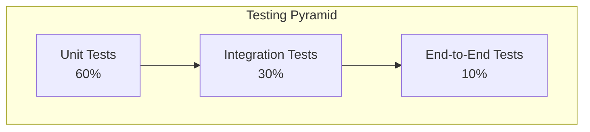

# Testing Strategy

## NHIS Fraud Analyzer System

---

## 1. Testing Philosophy

### 1.1 Testing Pyramid



### 1.2 Testing Principles

1. **Fast Feedback**: Unit tests run in milliseconds
2. **Isolation**: Tests don't depend on external systems
3. **Repeatability**: Same input always produces same output
4. **Independence**: Tests don't depend on each other
5. **Maintainability**: Tests are easy to understand and update
6. **Coverage**: Focus on critical paths and edge cases

---

## 2. Backend Testing Strategy

### 2.1 Unit Testing

#### 2.1.1 Framework: JUnit 5 + Mockito

**Test Coverage Goals**:
- **Services**: 80%+ coverage
- **Controllers**: 70%+ coverage
- **Utilities**: 90%+ coverage

#### 2.1.2 FraudScoringService Tests

```java
@ExtendWith(MockitoExtension.class)
class FraudScoringServiceTests {
    
    @Mock
    private ScoringConfig config;
    
    @InjectMocks
    private FraudScoringService fraudScoringService;
    
    @BeforeEach
    void setUp() {
        // Set up default config values
        when(config.getZeroAmountWeight()).thenReturn(70);
        when(config.getRatioHighThreshold()).thenReturn(2.0);
        when(config.getRatioHighWeight()).thenReturn(40);
        // ... other config values
    }
    
    @Test
    void testZeroAmountScoring() {
        // Given
        Claim claim = Claim.builder()
            .patientId("P001")
            .amountBilled(BigDecimal.ZERO)
            .build();
        
        Map<String, BigDecimal> medians = new HashMap<>();
        
        // When
        ScoreResult result = fraudScoringService.score(claim, medians);
        
        // Then
        assertThat(result.score()).isEqualTo(70);
        assertThat(result.category()).isEqualTo(ScoreCategory.MEDIUM);
        assertThat(result.reasons()).contains("amount is zero");
    }
    
    @Test
    void testHighRatioScoring() {
        // Given
        Claim claim = Claim.builder()
            .patientId("P002")
            .diagnosis("HYPERTENSION")
            .amountBilled(new BigDecimal("1000.00"))
            .build();
        
        Map<String, BigDecimal> medians = Map.of(
            "HYPERTENSION", new BigDecimal("400.00")
        );
        
        // When
        ScoreResult result = fraudScoringService.score(claim, medians);
        
        // Then
        assertThat(result.score()).isGreaterThanOrEqualTo(40);
        assertThat(result.reasons()).contains("amount > 2.0x diagnosis median");
    }
    
    @Test
    void testInfertilityDiagnosisScoring() {
        // Given
        Claim claim = Claim.builder()
            .patientId("P003")
            .diagnosis("INFERTILITY TREATMENT")
            .amountBilled(new BigDecimal("500.00"))
            .build();
        
        // When
        ScoreResult result = fraudScoringService.score(claim, Map.of());
        
        // Then
        assertThat(result.score()).isGreaterThanOrEqualTo(15);
        assertThat(result.reasons()).contains("high-risk diagnosis: infertility");
    }
    
    @Test
    void testPediatricHTNAnomalyScoring() {
        // Given
        Claim claim = Claim.builder()
            .patientId("P004")
            .age(10.0)
            .diagnosis("HYPERTENSION")
            .amountBilled(new BigDecimal("200.00"))
            .build();
        
        // When
        ScoreResult result = fraudScoringService.score(claim, Map.of());
        
        // Then
        assertThat(result.score()).isGreaterThanOrEqualTo(15);
        assertThat(result.reasons()).contains("pediatric HTN anomaly");
    }
    
    @Test
    void testDateAnomaliesScoring() {
        // Given
        Claim claim = Claim.builder()
            .patientId("P005")
            .encounterDate(LocalDate.of(2024, 1, 15))
            .dischargeDate(LocalDate.of(2024, 1, 10))  // Before encounter
            .amountBilled(new BigDecimal("300.00"))
            .build();
        
        // When
        ScoreResult result = fraudScoringService.score(claim, Map.of());
        
        // Then
        assertThat(result.score()).isGreaterThanOrEqualTo(20);
        assertThat(result.reasons()).contains("discharge before encounter");
    }
    
    @Test
    void testScoreClamping() {
        // Given - multiple high-scoring factors
        Claim claim = Claim.builder()
            .patientId("P006")
            .amountBilled(BigDecimal.ZERO)
            .diagnosis("INFERTILITY OSTEOPOROSIS")
            .encounterDate(null)
            .build();
        
        // When
        ScoreResult result = fraudScoringService.score(claim, Map.of());
        
        // Then - should not exceed 100
        assertThat(result.score()).isLessThanOrEqualTo(100);
        assertThat(result.score()).isGreaterThanOrEqualTo(0);
    }
    
    @Test
    void testCategoryLow() {
        // Given
        when(config.getLowMax()).thenReturn(25);
        Claim claim = Claim.builder()
            .patientId("P007")
            .amountBilled(new BigDecimal("100.00"))
            .build();
        
        // When
        ScoreResult result = fraudScoringService.score(claim, Map.of());
        
        // Then
        assertThat(result.category()).isEqualTo(ScoreCategory.LOW);
    }
}
```

#### 2.1.3 IngestionService Tests

```java
@ExtendWith(MockitoExtension.class)
class IngestionServiceTests {
    
    @Mock
    private ClaimRepository claimRepository;
    
    @Mock
    private FraudScoringService fraudScoringService;
    
    @Mock
    private ValidationService validationService;
    
    @InjectMocks
    private IngestionService ingestionService;
    
    @Test
    void testValidCSVIngestion() throws Exception {
        // Given
        MockMultipartFile file = new MockMultipartFile(
            "file",
            "claims.csv",
            "text/csv",
            createValidCSV().getBytes()
        );
        
        when(claimRepository.count()).thenReturn(0L, 3L);
        when(fraudScoringService.score(any(), any()))
            .thenReturn(new ScoreResult(50, ScoreCategory.MEDIUM, "test"));
        
        // When
        IngestResult result = ingestionService.ingest(file);
        
        // Then
        assertThat(result.total()).isEqualTo(3);
        assertThat(result.inserted()).isEqualTo(3);
        assertThat(result.skipped()).isEqualTo(0);
        verify(claimRepository).saveAll(anyList());
    }
    
    @Test
    void testEmptyFileRejection() {
        // Given
        MockMultipartFile file = new MockMultipartFile(
            "file",
            "empty.csv",
            "text/csv",
            new byte[0]
        );
        
        // When/Then
        assertThrows(BadRequestException.class, () -> {
            ingestionService.ingest(file);
        });
    }
    
    @Test
    void testFileSizeLimit() {
        // Given
        byte[] largeContent = new byte[26 * 1024 * 1024]; // 26MB
        MockMultipartFile file = new MockMultipartFile(
            "file",
            "large.csv",
            "text/csv",
            largeContent
        );
        
        // When/Then
        assertThrows(BadRequestException.class, () -> {
            ingestionService.ingest(file);
        });
    }
    
    @Test
    void testDuplicateDetection() throws Exception {
        // Given
        String csvContent = createCSVWithDuplicates();
        MockMultipartFile file = new MockMultipartFile(
            "file",
            "duplicates.csv",
            "text/csv",
            csvContent.getBytes()
        );
        
        // When
        IngestResult result = ingestionService.ingest(file);
        
        // Then
        assertThat(result.total()).isEqualTo(4);
        assertThat(result.inserted()).isLessThan(4); // Duplicates filtered
    }
    
    private String createValidCSV() {
        return "PATIENT ID,AGE,GENDER,DATE OF ENCOUNTER,DATE OF DISCHARGE,AMOUNT BILLED,DIAGNOSIS,FRAUD_TYPE\n" +
               "P001,45,M,2024-01-01,2024-01-05,1000.00,HYPERTENSION,\n" +
               "P002,30,F,2024-01-02,2024-01-06,500.00,DIABETES,\n" +
               "P003,60,M,2024-01-03,2024-01-07,2000.00,CARDIAC,\n";
    }
}
```

#### 2.1.4 ValidationService Tests

```java
class ValidationServiceTests {
    
    private ValidationService validationService = new ValidationService();
    
    @Test
    void testValidHeadersPass() {
        // Given
        String[] headers = {"PATIENT ID", "AGE", "GENDER", 
                           "DATE OF ENCOUNTER", "DATE OF DISCHARGE",
                           "AMOUNT BILLED", "DIAGNOSIS", "FRAUD_TYPE"};
        
        // When/Then - should not throw
        assertDoesNotThrow(() -> validationService.validateHeaders(headers));
    }
    
    @Test
    void testMissingHeadersThrows() {
        // Given
        String[] headers = {"PATIENT ID", "AGE"}; // Missing required headers
        
        // When/Then
        BadRequestException ex = assertThrows(BadRequestException.class, () -> {
            validationService.validateHeaders(headers);
        });
        
        assertThat(ex.getMessage()).contains("Missing required headers");
    }
    
    @Test
    void testCaseInsensitiveHeaders() {
        // Given
        String[] headers = {"patient id", "age", "gender", 
                           "date of encounter", "date of discharge",
                           "amount billed", "diagnosis", "fraud_type"};
        
        // When/Then - should not throw
        assertDoesNotThrow(() -> validationService.validateHeaders(headers));
    }
}
```

### 2.2 Integration Testing

#### 2.2.1 Framework: Spring Boot Test + TestContainers

```java
@SpringBootTest
@Testcontainers
class ClaimsControllerIntegrationTests {
    
    @Container
    static PostgreSQLContainer<?> postgres = new PostgreSQLContainer<>("postgres:15")
        .withDatabaseName("test")
        .withUsername("test")
        .withPassword("test");
    
    @Autowired
    private MockMvc mockMvc;
    
    @Autowired
    private ClaimRepository claimRepository;
    
    @BeforeEach
    void setUp() {
        claimRepository.deleteAll();
    }
    
    @Test
    void testGetClaimsWithPagination() throws Exception {
        // Given
        createTestClaims(50);
        
        // When/Then
        mockMvc.perform(get("/api/v1/claims")
                .param("page", "0")
                .param("size", "25"))
            .andExpect(status().isOk())
            .andExpect(jsonPath("$.content").isArray())
            .andExpect(jsonPath("$.content.length()").value(25))
            .andExpect(jsonPath("$.totalElements").value(50))
            .andExpect(jsonPath("$.totalPages").value(2));
    }
    
    @Test
    void testFilterClaimsByScore() throws Exception {
        // Given
        createClaimWithScore(20);  // LOW
        createClaimWithScore(50);  // MEDIUM
        createClaimWithScore(80);  // HIGH
        
        // When/Then - Get only high risk
        mockMvc.perform(get("/api/v1/claims")
                .param("minScore", "76"))
            .andExpect(status().isOk())
            .andExpect(jsonPath("$.content.length()").value(1))
            .andExpect(jsonPath("$.content[0].fraudScore").value(80));
    }
    
    @Test
    void testGetClaimById() throws Exception {
        // Given
        Claim claim = createTestClaim();
        UUID id = claim.getId();
        
        // When/Then
        mockMvc.perform(get("/api/v1/claims/{id}", id))
            .andExpect(status().isOk())
            .andExpect(jsonPath("$.id").value(id.toString()))
            .andExpect(jsonPath("$.patientId").exists());
    }
    
    @Test
    void testGetClaimByIdNotFound() throws Exception {
        // Given
        UUID nonExistentId = UUID.randomUUID();
        
        // When/Then
        mockMvc.perform(get("/api/v1/claims/{id}", nonExistentId))
            .andExpect(status().isNotFound());
    }
}
```

#### 2.2.2 Repository Tests

```java
@DataJpaTest
class ClaimRepositoryTests {
    
    @Autowired
    private ClaimRepository claimRepository;
    
    @Test
    void testSaveAndRetrieveClaim() {
        // Given
        Claim claim = Claim.builder()
            .patientId("P001")
            .age(45.0)
            .gender("M")
            .amountBilled(new BigDecimal("1000.00"))
            .fraudScore(50)
            .scoreCategory(ScoreCategory.MEDIUM)
            .build();
        
        // When
        Claim saved = claimRepository.save(claim);
        Claim retrieved = claimRepository.findById(saved.getId()).orElseThrow();
        
        // Then
        assertThat(retrieved.getPatientId()).isEqualTo("P001");
        assertThat(retrieved.getFraudScore()).isEqualTo(50);
    }
    
    @Test
    void testCountByScoreCategory() {
        // Given
        createClaimWithCategory(ScoreCategory.LOW);
        createClaimWithCategory(ScoreCategory.LOW);
        createClaimWithCategory(ScoreCategory.HIGH);
        
        // When
        long lowCount = claimRepository.countByScoreCategory(ScoreCategory.LOW);
        long highCount = claimRepository.countByScoreCategory(ScoreCategory.HIGH);
        
        // Then
        assertThat(lowCount).isEqualTo(2);
        assertThat(highCount).isEqualTo(1);
    }
    
    @Test
    void testSpecificationFiltering() {
        // Given
        createClaimWithDiagnosis("HYPERTENSION");
        createClaimWithDiagnosis("DIABETES");
        createClaimWithDiagnosis("HYPERTENSION");
        
        // When
        Specification<Claim> spec = ClaimSpecifications.diagnosisContains("HYPERTENSION");
        List<Claim> results = claimRepository.findAll(spec);
        
        // Then
        assertThat(results).hasSize(2);
    }
}
```

### 2.3 Contract Testing

#### 2.3.1 API Contract Tests

```java
@SpringBootTest
@AutoConfigureMockMvc
class APIContractTests {
    
    @Autowired
    private MockMvc mockMvc;
    
    @Test
    void testClaimsListResponseSchema() throws Exception {
        mockMvc.perform(get("/api/v1/claims"))
            .andExpect(status().isOk())
            .andExpect(jsonPath("$.content").isArray())
            .andExpect(jsonPath("$.pageable").exists())
            .andExpect(jsonPath("$.totalElements").exists())
            .andExpect(jsonPath("$.totalPages").exists())
            .andExpect(jsonPath("$.size").exists())
            .andExpect(jsonPath("$.number").exists());
    }
    
    @Test
    void testClaimResponseSchema() throws Exception {
        // Assuming at least one claim exists
        mockMvc.perform(get("/api/v1/claims"))
            .andExpect(status().isOk())
            .andExpect(jsonPath("$.content[0].id").exists())
            .andExpect(jsonPath("$.content[0].patientId").exists())
            .andExpect(jsonPath("$.content[0].fraudScore").exists())
            .andExpect(jsonPath("$.content[0].scoreCategory").exists());
    }
}
```

---

## 3. Frontend Testing Strategy

### 3.1 Unit Testing

#### 3.1.1 Framework: Vitest + React Testing Library

```typescript
// components/__tests__/MetricCard.test.tsx
import { render, screen } from '@testing-library/react'
import { describe, it, expect } from 'vitest'
import { MetricCard } from '../MetricCard'
import { IconFileAnalytics } from '@tabler/icons-react'

describe('MetricCard', () => {
  it('renders title and value correctly', () => {
    render(
      <MetricCard
        title="Total Claims"
        value="1,234"
        Icon={IconFileAnalytics}
      />
    )
    
    expect(screen.getByText('Total Claims')).toBeInTheDocument()
    expect(screen.getByText('1,234')).toBeInTheDocument()
  })
  
  it('renders delta information when provided', () => {
    render(
      <MetricCard
        title="Total Claims"
        value="1,234"
        deltaValue="+12%"
        deltaLabel="vs last month"
        positive={true}
        Icon={IconFileAnalytics}
      />
    )
    
    expect(screen.getByText('+12%')).toBeInTheDocument()
    expect(screen.getByText('vs last month')).toBeInTheDocument()
  })
})
```

#### 3.1.2 API Client Tests

```typescript
// lib/__tests__/api.test.ts
import { describe, it, expect, beforeEach, vi } from 'vitest'
import { getJson, postMultipart } from '../api'

describe('API Client', () => {
  beforeEach(() => {
    global.fetch = vi.fn()
  })
  
  it('getJson makes GET request and returns JSON', async () => {
    const mockData = { id: 1, name: 'Test' }
    global.fetch = vi.fn(() =>
      Promise.resolve({
        ok: true,
        json: () => Promise.resolve(mockData),
      })
    ) as any
    
    const result = await getJson('/api/test')
    
    expect(global.fetch).toHaveBeenCalledWith(
      expect.stringContaining('/api/test'),
      expect.objectContaining({
        headers: expect.objectContaining({
          Accept: 'application/json',
        }),
      })
    )
    expect(result).toEqual(mockData)
  })
  
  it('getJson throws error on non-OK response', async () => {
    global.fetch = vi.fn(() =>
      Promise.resolve({
        ok: false,
        status: 404,
        text: () => Promise.resolve('Not found'),
      })
    ) as any
    
    await expect(getJson('/api/test')).rejects.toThrow('404')
  })
})
```

### 3.2 Component Integration Testing

```typescript
// pages/__tests__/ClaimsPage.test.tsx
import { render, screen, waitFor } from '@testing-library/react'
import userEvent from '@testing-library/user-event'
import { describe, it, expect, vi, beforeEach } from 'vitest'
import { ClaimsPage } from '../ClaimsPage'
import * as api from '../../lib/api'

vi.mock('../../lib/api')

describe('ClaimsPage', () => {
  const mockClaimsData = {
    content: [
      {
        id: '1',
        patientId: 'P001',
        fraudScore: 85,
        scoreCategory: 'HIGH',
        diagnosis: 'HYPERTENSION',
      },
    ],
    totalElements: 1,
    totalPages: 1,
    size: 25,
    number: 0,
  }
  
  beforeEach(() => {
    vi.mocked(api.getJson).mockResolvedValue(mockClaimsData)
  })
  
  it('renders claims table', async () => {
    render(<ClaimsPage />)
    
    await waitFor(() => {
      expect(screen.getByText('P001')).toBeInTheDocument()
    })
  })
  
  it('filters claims by search query', async () => {
    const user = userEvent.setup()
    render(<ClaimsPage />)
    
    const searchInput = screen.getByPlaceholderText('Search by diagnosis...')
    await user.type(searchInput, 'DIABETES')
    
    await waitFor(() => {
      expect(api.getJson).toHaveBeenCalledWith(
        expect.stringContaining('diagnosis=DIABETES')
      )
    })
  })
  
  it('handles pagination', async () => {
    const user = userEvent.setup()
    render(<ClaimsPage />)
    
    const nextButton = screen.getByText('Next')
    await user.click(nextButton)
    
    await waitFor(() => {
      expect(api.getJson).toHaveBeenCalledWith(
        expect.stringContaining('page=1')
      )
    })
  })
})
```

### 3.3 End-to-End Testing

#### 3.3.1 Framework: Playwright

```typescript
// e2e/claims-workflow.spec.ts
import { test, expect } from '@playwright/test'

test.describe('Claims Workflow', () => {
  test.beforeEach(async ({ page }) => {
    await page.goto('http://localhost:3000')
  })
  
  test('should display dashboard with metrics', async ({ page }) => {
    await page.goto('/dashboard')
    
    await expect(page.locator('text=Total Claims')).toBeVisible()
    await expect(page.locator('text=Average Amount')).toBeVisible()
    await expect(page.locator('text=High Risk')).toBeVisible()
  })
  
  test('should filter claims by fraud score', async ({ page }) => {
    await page.goto('/claims')
    
    // Open filters
    await page.click('button:has-text("Filters")')
    
    // Set min score
    await page.fill('input[name="minScore"]', '76')
    
    // Apply filters
    await page.click('button:has-text("Apply")')
    
    // Verify high-risk claims are shown
    const badges = page.locator('.badge:has-text("HIGH")')
    await expect(badges.first()).toBeVisible()
  })
  
  test('should upload CSV file', async ({ page }) => {
    await page.goto('/admin')
    
    // Upload file
    const fileInput = page.locator('input[type="file"]')
    await fileInput.setInputFiles('test-data/sample-claims.csv')
    
    // Click upload button
    await page.click('button:has-text("Upload")')
    
    // Verify success message
    await expect(page.locator('text=Successfully uploaded')).toBeVisible()
  })
  
  test('should search claims by diagnosis', async ({ page }) => {
    await page.goto('/claims')
    
    // Search
    await page.fill('input[placeholder*="diagnosis"]', 'DIABETES')
    
    // Wait for results
    await page.waitForResponse(resp => 
      resp.url().includes('/api/v1/claims') && resp.status() === 200
    )
    
    // Verify results contain search term
    const diagnosisCells = page.locator('td:has-text("DIABETES")')
    await expect(diagnosisCells.first()).toBeVisible()
  })
})
```

---

## 4. Performance Testing

### 4.1 Load Testing with JMeter

```xml
<!-- JMeter Test Plan -->
<jmeterTestPlan>
  <ThreadGroup>
    <stringProp name="ThreadGroup.num_threads">100</stringProp>
    <stringProp name="ThreadGroup.ramp_time">60</stringProp>
    <stringProp name="ThreadGroup.duration">300</stringProp>
    
    <HTTPSamplerProxy>
      <stringProp name="HTTPSampler.path">/api/v1/claims</stringProp>
      <stringProp name="HTTPSampler.method">GET</stringProp>
    </HTTPSamplerProxy>
  </ThreadGroup>
</jmeterTestPlan>
```

### 4.2 Performance Benchmarks

| Endpoint | Target Response Time | Max Concurrent Users |
|----------|---------------------|---------------------|
| GET /claims | < 200ms | 1000 |
| POST /admin/ingest | < 5s (10MB file) | 10 |
| GET /metrics | < 100ms | 500 |
| GET /metrics/chart-data | < 300ms | 500 |

---

## 5. Test Data Management

### 5.1 Test Data Generation

```java
public class TestDataFactory {
    
    public static Claim createTestClaim() {
        return Claim.builder()
            .patientId("P" + UUID.randomUUID().toString().substring(0, 8))
            .age(RandomUtils.nextDouble(18, 90))
            .gender(RandomUtils.nextBoolean() ? "M" : "F")
            .encounterDate(LocalDate.now().minusDays(RandomUtils.nextInt(1, 365)))
            .amountBilled(new BigDecimal(RandomUtils.nextDouble(100, 10000)))
            .diagnosis(randomDiagnosis())
            .fraudScore(RandomUtils.nextInt(0, 100))
            .scoreCategory(randomCategory())
            .build();
    }
    
    public static List<Claim> createTestClaims(int count) {
        return IntStream.range(0, count)
            .mapToObj(i -> createTestClaim())
            .collect(Collectors.toList());
    }
}
```

---

## 6. Test Coverage Goals

| Component | Target Coverage | Critical Paths |
|-----------|----------------|----------------|
| **FraudScoringService** | 95% | All scoring rules |
| **IngestionService** | 90% | CSV parsing, validation |
| **Controllers** | 80% | All endpoints |
| **Repositories** | 70% | Custom queries |
| **Frontend Components** | 70% | User interactions |
| **API Integration** | 90% | All API calls |

---

## 7. Continuous Testing

### 7.1 CI/CD Integration

```yaml
# .github/workflows/test.yml
name: Tests

on: [push, pull_request]

jobs:
  backend-tests:
    runs-on: ubuntu-latest
    steps:
      - uses: actions/checkout@v2
      - name: Set up JDK 21
        uses: actions/setup-java@v2
        with:
          java-version: '21'
      - name: Run tests
        run: ./gradlew test
      - name: Upload coverage
        uses: codecov/codecov-action@v2
  
  frontend-tests:
    runs-on: ubuntu-latest
    steps:
      - uses: actions/checkout@v2
      - name: Setup Node
        uses: actions/setup-node@v2
        with:
          node-version: '18'
      - name: Install dependencies
        run: pnpm install
      - name: Run tests
        run: pnpm test
  
  e2e-tests:
    runs-on: ubuntu-latest
    steps:
      - uses: actions/checkout@v2
      - name: Run E2E tests
        run: pnpm test:e2e
```

---

## 8. Test Maintenance Strategy

1. **Regular Review**: Quarterly review of test coverage
2. **Flaky Test Management**: Identify and fix flaky tests immediately
3. **Test Refactoring**: Keep tests DRY and maintainable
4. **Documentation**: Document complex test scenarios
5. **Performance Monitoring**: Track test execution time

